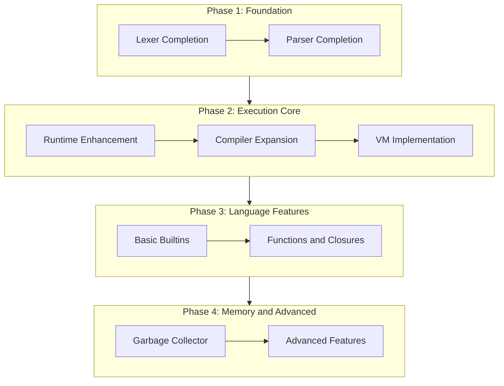

# JavaScript Engine Implementation Order

## Current State Assessment

Your codebase already has solid foundations:

| Component | Completeness | Status |

|-----------|--------------|--------|

| Lexer | ~85% | Most tokens, missing comments |

| AST | ~75% | Core nodes defined |

| Parser | ~60% | Basic statements/expressions |

| Runtime | ~40% | Value enum, basic Object/Environment |

| Compiler | ~25% | Literals and binary ops only |

| VM | ~25% | Basic arithmetic only |

| Builtins | 0% | Stub only |

| GC | 0% | Stub only |

## Recommended Implementation Order



---

## Phase 1: Complete Lexer and Parser

### 1.1 Lexer Completion

Location: [`crates/spacey-spidermonkey/src/lexer/scanner.rs`](crates/spacey-spidermonkey/src/lexer/scanner.rs)

Missing features to add:

- Single-line comments (`//`)
- Multi-line comments (`/* */`)
- Unicode escape sequences in strings (`\u{xxxx}`)
- Regex literal scanning (context-sensitive)
- Line terminator tracking for ASI
- Better error recovery with source locations

### 1.2 Parser Completion  

Location: [`crates/spacey-spidermonkey/src/parser/parser.rs`](crates/spacey-spidermonkey/src/parser/parser.rs)

Missing features to add:

- Switch statements
- Do-while loops
- For-in/for-of loops
- Try/catch/finally (structure exists in AST)
- Break/continue with labels
- Arrow functions
- Class declarations
- Spread/rest operators
- Destructuring patterns
- Template literals with expressions
- Automatic Semicolon Insertion (ASI)

---

## Phase 2: Runtime and Execution

### 2.1 Runtime Enhancement

Location: [`crates/spacey-spidermonkey/src/runtime/`](crates/spacey-spidermonkey/src/runtime/)

Key additions:

- **Call frames** for function execution context
- **Scope chain** linking environments properly
- **`this` binding** resolution
- **Object heap** (prepare for GC integration)
- **Function objects** as first-class values

### 2.2 Compiler Expansion

Location: [`crates/spacey-spidermonkey/src/compiler/codegen.rs`](crates/spacey-spidermonkey/src/compiler/codegen.rs)

Add compilation for:

- Variable declarations with scope tracking
- Control flow (if/while/for) with jump patching
- Function declarations and expressions
- Closure capture analysis
- Object and array literals
- Property access and assignment
- Call expressions

### 2.3 VM Completion

Location: [`crates/spacey-spidermonkey/src/vm/interpreter.rs`](crates/spacey-spidermonkey/src/vm/interpreter.rs)

Implement remaining opcodes:

- Variable load/store (local, global, upvalue)
- Jump instructions with proper offsets
- Function call/return with call stack
- Object/array creation and property access
- Exception handling (try/catch)

---

## Phase 3: Builtins and Functions

### 3.1 Basic Builtins

Location: [`crates/spacey-spidermonkey/src/builtins/`](crates/spacey-spidermonkey/src/builtins/)

Start with essential builtins:

1. `console.log` (critical for testing/debugging)
2. `Object` constructor and prototype methods
3. `Array` constructor and prototype methods
4. `String` prototype methods
5. `Number`, `Boolean`, `Math`
6. `Error` types

### 3.2 Functions and Closures

- Proper closure implementation with upvalue capture
- `Function.prototype.call/apply/bind`
- Arrow function `this` binding
- Rest parameters and spread arguments

---

## Phase 4: GC and Advanced Features

### 4.1 Garbage Collector

Location: [`crates/spacey-spidermonkey/src/gc/`](crates/spacey-spidermonkey/src/gc/)

Implementation strategy:

1. Start with simple mark-and-sweep
2. Define `GcObject` wrapper type for heap objects
3. Track roots (stack, globals)
4. Add write barriers later for generational GC

### 4.2 Advanced Features (Later)

- Promises and async/await
- Iterators and generators
- Proxies and Reflect
- ES Modules
- JIT compilation (much later)

---

## Suggested First Steps

Wire up the existing pipeline in [`lib.rs`](crates/spacey-spidermonkey/src/lib.rs):

```rust
pub fn eval(&mut self, source: &str) -> Result<Value, Error> {
    // 1. Lex
    let mut parser = Parser::new(source);
    
    // 2. Parse
    let ast = parser.parse_program()?;
    
    // 3. Compile
    let mut compiler = Compiler::new();
    let bytecode = compiler.compile(&ast)?;
    
    // 4. Execute
    let mut vm = VM::new();
    vm.execute(&bytecode)
}
```

This will immediately let you test the full pipeline with expressions like `1 + 2 * 3`.

---

## Development Strategy

1. **Test-driven**: Add tests before/during each feature
2. **Incremental**: Get simple cases working, then add complexity
3. **Wire early**: Connect components even if incomplete
4. **REPL feedback**: Use your REPL to manually test as you go